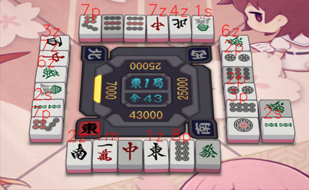
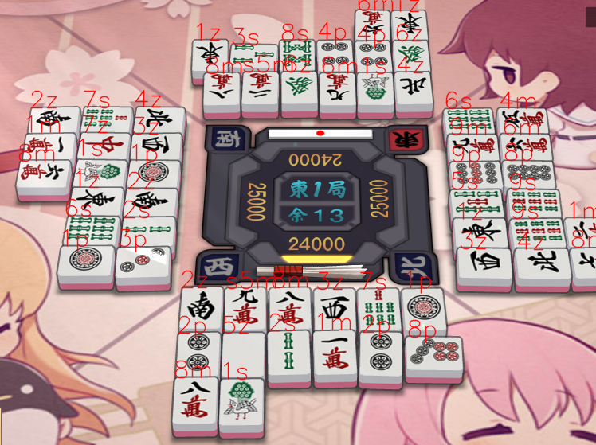

# mahjong-sol_recognition
识别雀魂麻将桌上歪曲扭八的麻将牌，目标是实现一个自动避铳机。现在还停留在目标识别阶段

部分数据来源于：https://github.com/MaZhengKe/mahjong

Prototypical Networks实现参考：https://github.com/oscarknagg/few-shot 

## 现状
完成了传统视觉的识别方式，准确度80%

使用ProtoNet网络对麻将牌进行分类，实际表现...

## 预计
1. 添加使用神经网络的识别方式
    - 数据集制作 -> fin 每个牌种至少4张 
    - 已完成模型训练 -> fin 测试集上准确率97%
    - 整合进程序
2. 自动化
